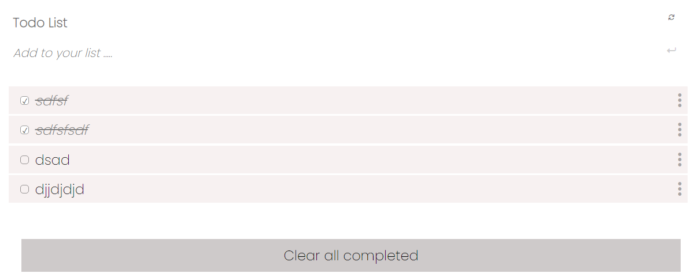

# Todo list

> display todo list from array

Additional description about the project and its features.

## Built With

- Javascript
- css
- html
- linter
- webpack

## Live Demo

[Live Demo Link](https://livedemo.com)

## Getting Started

**Download code from my repositor and run local in your computer.**

To get a local copy up and running follow these simple example steps.

### Prerequisites

### Setup

open my GitHub download code

### Install

install any code editor (vs code or atom)

### Usage

any platform

### Run tests

### Deployment

## Authors

👤 \*_Mucyo_

- GitHub: [@githubhandle](https://github.com/Mucyosoda)
- Twitter: [@twitterhandle](https://twitter.com/home)
- LinkedIn: [LinkedIn](linkedin.com/in/claude-mucyo-b95405106)

## 🤝 Contributing

Contributions, issues, and feature requests are welcome!

Feel free to check the [issues page](https://github.com/Mucyosoda/Todo-List/issues).

## Show your support

Contributions, issues, and feature requests are welcome!
Give a ⭐️ if you like this project!

## Acknowledgments

- Microverse
- MY God

## 📝 License

This project is [MIT](./MIT.md) licensed.
